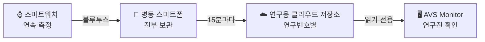

  &nbsp;&nbsp;&nbsp;
  &nbsp;&nbsp;&nbsp;
  

# AVS Monitor

**대동맥판막협착증(AVS) 웨어러블 생체신호 코호트 — 수집 모니터링 플랫폼**
*Wearable biosignal cohort for aortic valve stenosis — data-collection monitoring platform*

🔗 **https://limminsik.github.io/AVS_monitor/** (연구진 로그인 필요 · 예시 화면은 첫 화면의 «예시 화면 보기»)

---

## 연구 소개

**신호 품질 지표(SQI) 기반 고품질 생체신호 코호트 구축과 대동맥판막협착증 조기 위험 탐지를 위한 인공지능 방법론 개발**

대동맥판막협착증은 증상이 늦게 나타나고 진행이 빨라 조기 발견이 중요한 판막 질환입니다. 이 연구는 입원 환자가 손목에 착용한 스마트워치로 생체신호(광용적맥파 PPG 등)를 연속으로 수집해 **품질이 검증된 웨어러블 코호트**를 만들고, 이를 바탕으로 **위험을 조기에 탐지하는 인공지능 방법론**을 개발합니다.

| | |
|---|---|
| 수행 | 가천대학교 DAC LAB(Data Science & AI Convergence) · 가천대 길병원 심혈관센터 |
| 대상 | 대동맥판막협착증 입원 환자 코호트 (목표 100명) |
| 수집 | 스마트워치(Galaxy Watch) 연속 착용 — 대상자당 입원 기간 최대 5일 · 100시간 |
| 신호 | PPG(초록 · 적외선 · 빨강) 중심, 심박 · 박동 간격(IBI) · 가속도 등 |
| 핵심 | 신호 품질 지표(SQI)로 걸러낸 고품질 자료 · 수집 과정의 완전성 관리 |

## 수집 흐름

워치는 측정하고 보내기만, 병동 폰은 받은 자료를 모두 보관하고 올리기만 합니다. 연구진은 병동에 가지 않고도 이 모니터링 화면에서 수집이 빠짐없이 이어지는지 확인합니다.

## 모니터링 플랫폼

| 화면 | 보여 주는 것 |
|---|---|
| **AVS Cohort** | 등록 인원 · 현재 수집 · 수집 완료, 대상자별 누적 수집 시간, 기기별 연결 상태와 지난 24시간 빈 구간 |
| **상세 현황** | 대상자 한 명의 전 기간 수집 상태(날짜 × 시간)와 시간대별 수신율 |
| **측정 값** | 수집된 신호를 시간축 하나로 이어 보는 파형 화면과, 같은 구간의 원본 값 |
| **로그** | 수집 기기가 남긴 기록과 이슈 |

- 대상자는 **연구번호로만** 표시됩니다.
- 이 저장소에는 **연구 자료가 없습니다.** 허가된 연구 계정으로 로그인했을 때만 브라우저가 자료를 읽기 전용으로 불러오고, 창을 닫으면 사라집니다.
- 서버 없이 정적 웹(HTML · CSS · JavaScript) + Google 로그인으로 동작합니다.

---

### English summary

AVS Monitor is the data-collection monitoring platform of a wearable biosignal cohort study on **aortic valve stenosis (AVS)**, conducted by **DAC LAB, Gachon University** with **Gachon University Gil Medical Center**. Inpatients wear a smartwatch that continuously records PPG and related signals; a ward phone stores and uploads the data, and researchers use this page to check that collection is complete and continuous. The study aims to build an SQI-verified, high-quality wearable cohort and to develop AI methods for early risk detection. No research data is stored in this repository.

## License

© 2026 Minsik Lim. All rights reserved. — [`LICENSE`](LICENSE)
